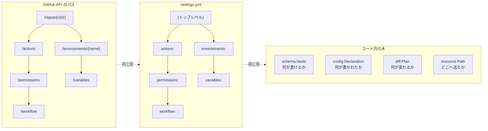
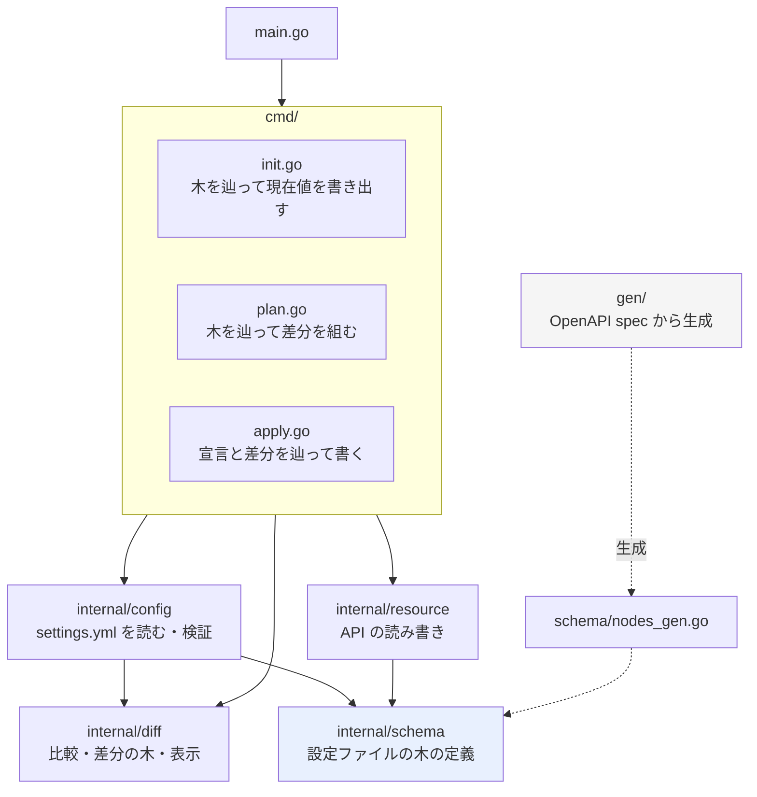
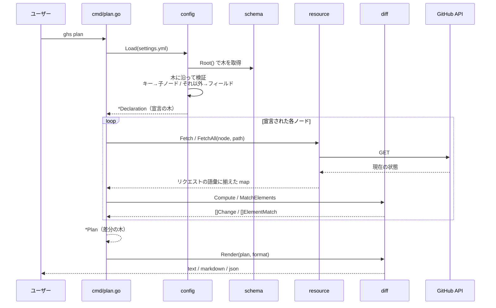
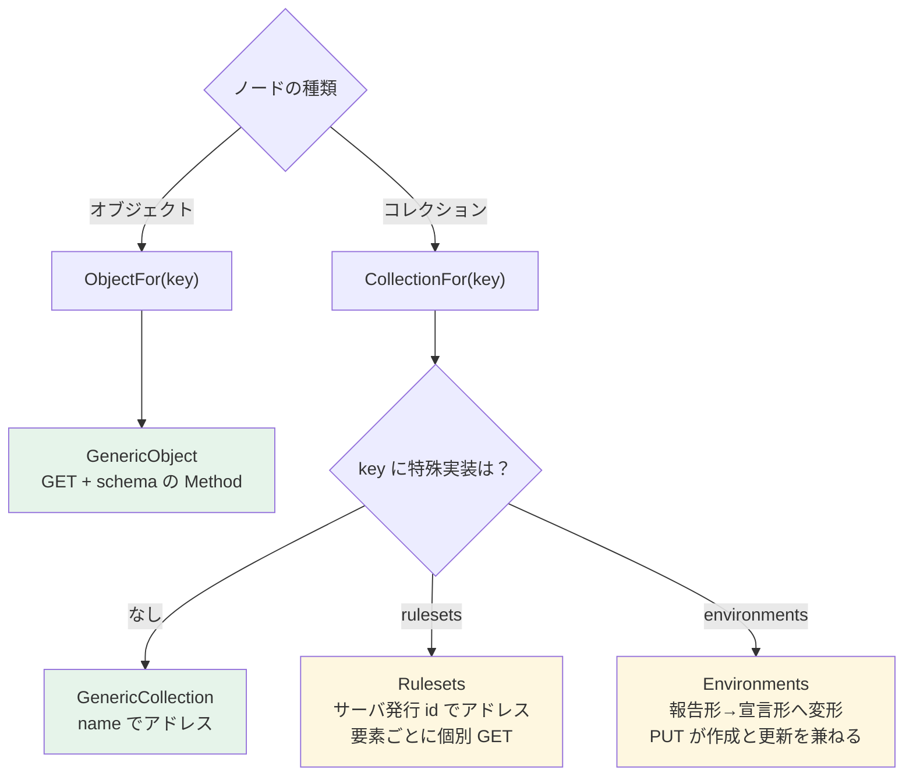
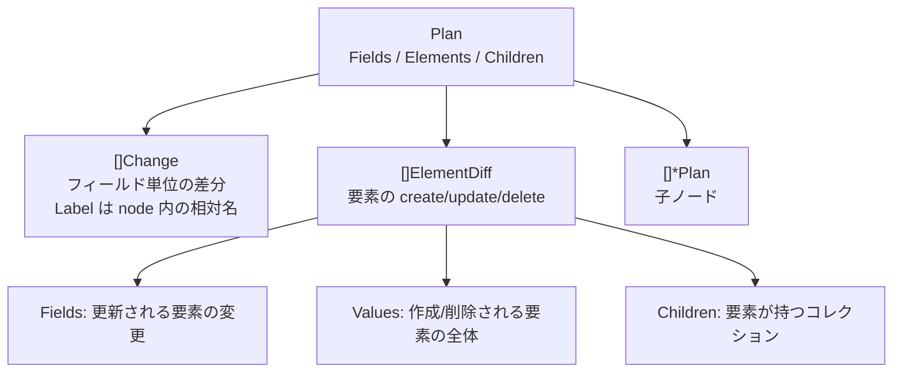

# ghs の構造

コードを読むときの地図。設計の理由は [design.md](design.md) にある。

## 鍵になる考え方: 同じ形の木が 5 つ

これさえ掴めば残りは追える。**API のパス構造が、そのまま設定ファイルの構造であり、コード内のあらゆる木の構造**になっている。

`schema.Node` の `Segment` が「ファイル内のキー」と「API パスの一部」を兼ねている。だから設定の置き場所は、それを変更するエンドポイントを読めば決まる。

## パッケージ

`diff` はどのパッケージにも依存しない（比較と表示だけ）。`resource` は API を叩くだけで差分を知らない。両者を結ぶのは `cmd`。

## plan の 1 サイクル

`apply` は同じ `build()` で `Declaration` と `Plan` を得たあと、両方を一緒に辿って書き込む。差分のないノードは飛ばす。

## resource: 大半は書かなくていい

緑が汎用（パスとメソッドだけで動く）、黄が手書き（GitHub が自分のパターンから外れる箇所）。新しい設定を足すとき、多くの場合 `gen/main.go` の `operations` に 1 行足すだけで済む。

## 差分の木

`Change` は「どこにあるか」を持たない。位置は木が持つ。text 出力は木を歩き、markdown / json は `flatten()` で平坦なパスに畳む。

## ファイルの対応

| やりたいこと | 見る場所 |
| --- | --- |
| 管理できる設定を増やす | `gen/main.go` の `operations` |
| 設定ファイルの検証規則 | `internal/config/config.go`, `collection.go` |
| 比較のセマンティクス（配列、null、欠落） | `internal/diff/diff.go` |
| plan の見た目 | `internal/diff/render.go` |
| API 呼び出しの特殊対応 | `internal/resource/rulesets.go`, `environments.go` |
| spec の欠落を埋める | `internal/schema/extra.go` |
